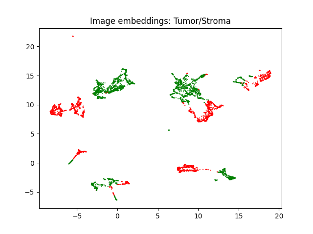

## Differentiate Tumor/Stroma Patch
### Prepare training dataset
1. Annotation in QuPath. Currently (12/11/2024), there are 5 case annotated. 
2. Parse Burak's annotation, create image and annotation mask pairs.
3. Split mask images into smaller image pairs (prepare_training.py). Image pairs can be used to train image segmentation model.
But here, we use them for patch classification model.

### Inspect dataset
1. Use CTransPath to get image embeddings. (get_features_with_classes.py)
2. Visualize embeddings with UMAP. (visualization.py)
> By slide. Points with the same color denote samples from one slide.

> By image label. Red: Tumor, Green: Stroma.

